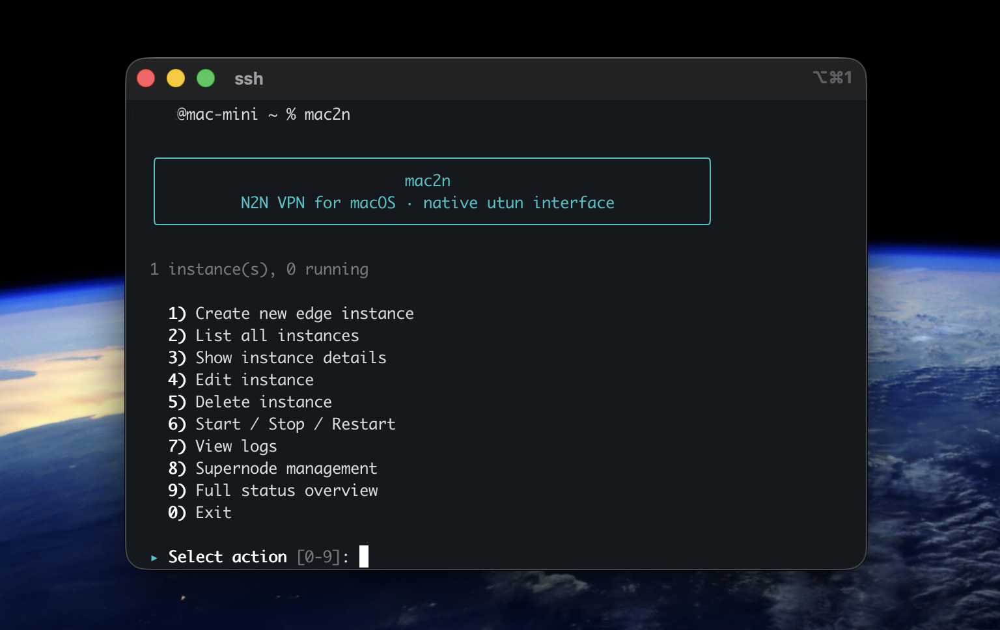

<div align="center">

<br>

# mac2n

### Peer-to-peer VPN for macOS — zero kexts, pure utun

Build and run [n2n](https://github.com/ntop/n2n) v3.0.0 on macOS using the native **utun** kernel interface.
No third-party TUN/TAP drivers. No kernel extensions. Just works.

<br>



<br>
<br>

[](#prerequisites)
[](#macos-specific-details)
[](https://github.com/ntop/n2n/commit/6a64e72dc6cdfac818ffb210515b17cfa70f4bb3)
[](LICENSE)

</div>

<br>

## Get Started in Seconds

```bash
bash -c "$(curl -fsSL https://raw.githubusercontent.com/mchsk/mac2n/main/install.sh)"
```

The installer handles **everything** — Xcode CLI tools, Homebrew, build toolchain, n2n compilation, binary signing, and firewall setup. Requires `sudo`.

Once installed:

```bash
mac2n
```

<br>

## Why mac2n

<table>
<tr>
<td width="50%" valign="top">

**Multi-instance manager**
Run multiple VPN tunnels simultaneously — each with its own community, supernode, IP, encryption, and LaunchDaemon.

**Interactive wizard with presets**
Guided setup for Home VPN, Remote Access, Site-to-Site, Gaming, IoT Mesh, or fully custom configurations.

**Validation built in**
IP conflicts, port collisions, key strength, address formats — caught before they become problems.

</td>
<td width="50%" valign="top">

**Native utun interface**
No kext or DEXT installation. Works on Apple Silicon and Intel. Interfaces appear as `utunN`.

**LaunchDaemon integration**
Services persist across reboots. Start, stop, restart, and tail logs per instance or all at once.

**Backup supernode failover**
Each instance supports a secondary supernode. Automatic rotation by load, RTT, or MAC.

</td>
</tr>
</table>

<br>

## Prerequisites

- macOS 12+ (Monterey or later)
- An admin account with `sudo` privileges

> Xcode Command Line Tools and Homebrew are installed automatically if missing.

<br>

## Usage

### Interactive Mode

```bash
mac2n              # opens the interactive menu
```

### CLI Commands

#### Instance Management

```bash
mac2n create [name]       # Create a new edge instance (guided wizard)
mac2n list                # List all instances with status
mac2n show <name>         # Detailed view of a single instance
mac2n edit <name>         # Edit an existing instance
mac2n delete <name>       # Delete an instance (stops if running)
```

#### Service Control

```bash
mac2n start <name>        # Start a single instance
mac2n start --all         # Start all instances
mac2n stop <name>         # Stop a single instance
mac2n stop --all          # Stop all instances
mac2n restart <name>      # Restart a single instance
mac2n restart --all       # Restart all instances
mac2n logs <name>         # Tail log output for an instance
```

#### Supernode

```bash
mac2n supernode create    # Configure a supernode
mac2n supernode status    # Show supernode status
mac2n supernode start     # Start supernode
mac2n supernode stop      # Stop supernode
mac2n supernode restart   # Restart supernode
mac2n supernode delete    # Remove supernode
```

#### Other

```bash
mac2n status              # Full overview (all instances + supernode + network)
mac2n self-update         # Pull latest source and rebuild
mac2n migrate             # Migrate old single-instance setup
mac2n uninstall           # Remove all n2n services and config
mac2n help                # Show help
```

### Examples

```bash
# Create two edge instances for different networks
mac2n create home
mac2n create office

# Start everything
mac2n start --all

# Check what's running
mac2n status

# Edit the office instance
mac2n edit office
```

<br>

## Use Case Presets

When creating an instance, the wizard offers presets with smart defaults:

| Preset | Cipher | Routing | MTU | Typical Use |
|--------|--------|---------|-----|-------------|
| **Home VPN** | AES-256 | no | 1290 | Personal devices on a private network |
| **Remote Access** | ChaCha20 | yes | 1290 | Reach home/office from anywhere |
| **Site-to-Site** | AES-256 | yes | 1290 | Bridge two separate LANs |
| **Gaming / LAN** | None | no | 1400 | Low-latency direct P2P |
| **IoT Mesh** | Speck-CTR | yes | 1000 | Lightweight encrypted mesh |
| **Custom** | — | — | — | Full manual configuration |

<br>

## Instance Storage

Each instance is stored independently:

| File | Location |
|------|----------|
| Config | `~/.config/n2n/instances/<name>/edge.conf` |
| Plist | `/Library/LaunchDaemons/org.ntop.n2n-edge.<name>.plist` |
| Log | `/var/log/n2n-edge-<name>.log` |

<br>

## Backup Supernode

Each edge instance supports a **backup supernode** for failover. When the primary supernode becomes unreachable, n2n automatically rotates to the backup. Configure via:

```bash
mac2n edit <name>   # choose "Network settings" → add/change backup supernode
```

The supernode selection strategy (by load, RTT, or MAC) can be set under "Advanced settings".

<br>

## Validation

The wizard validates all inputs:

- Instance names, community names, encryption keys (with strength feedback)
- VPN IPs (private range, conflict detection with interfaces and other instances)
- Supernode addresses (`host:port` format)
- Ports (range check, in-use detection, cross-instance conflict prevention)
- MTU, MAC address format, CIDR subnet

<br>

## Security Note

Encryption keys are passed as command-line arguments to the `edge` binary. This is how n2n works — keys may be visible to other local users via `ps`. The LaunchDaemon plist files containing keys are created with mode `600` (owner-only read), but the running process arguments are not hidden from the process table. This is an inherent limitation of n2n's architecture.

<br>

## macOS-Specific Details

This build uses the native **utun** interface:

- No kext/DEXT installation needed
- Works on Apple Silicon and Intel
- Interface appears as `utunN` (e.g., `utun7`)
- Synthetic Ethernet headers with ARP cache for peer MAC resolution
- Automatic subnet route management via the `route` command

<br>

## Manual Install

<details>
<summary>Clone and build manually instead of the one-liner</summary>

<br>

`sudo` is required for installation, binary signing, and firewall setup:

```bash
git clone --recursive https://github.com/mchsk/mac2n.git ~/.mac2n
cd ~/.mac2n
./build.sh all
sudo ln -sf ~/.mac2n/wizard.sh /usr/local/bin/mac2n
```

If you already cloned without `--recursive`:

```bash
git submodule update --init
```

</details>

<br>

## Build Script

```bash
./build.sh deps        # Install Homebrew dependencies
./build.sh source      # Fetch n2n source (submodule or clone)
./build.sh build       # Configure + make (autotools)
./build.sh install     # Install to /usr/local + bundle OpenSSL dylib
./build.sh harden      # Ad-hoc sign binaries + add firewall exceptions
./build.sh verify      # Smoke-test that edge and supernode execute
./build.sh clean       # Clean build artifacts (keeps source)
./build.sh all         # All of the above (default)
```

CMake alternative: `./build.sh build-cmake` instead of `./build.sh build`.

Custom prefix: `PREFIX=/opt/n2n ./build.sh all`.

<br>

## Service Management

```bash
# Use mac2n (recommended)
mac2n start home
mac2n stop home
mac2n logs home

# Or use launchctl directly
sudo launchctl load /Library/LaunchDaemons/org.ntop.n2n-edge.home.plist
sudo launchctl start org.ntop.n2n-edge.home
```

<br>

<details>
<summary><strong>Manual edge & supernode usage</strong></summary>

<br>

### Edge Node (client)

```bash
sudo edge -c mynetwork -k mysecretkey -a static:10.0.0.1/24 -l supernode.example.com:7777
```

### Supernode (relay server)

```bash
sudo supernode -p 7777 -f
```

### Key Options

| Flag | Description |
|------|-------------|
| `-c` | Community name (like a VLAN) |
| `-k` | Encryption key (shared secret) |
| `-a` | VPN IP address (`static:IP/CIDR`) |
| `-l` | Supernode address (`host:port`), repeatable for failover |
| `-p` | Supernode listen port |
| `-A3` | AES-256-CBC encryption |
| `-A4` | ChaCha20 encryption |
| `-A5` | Speck-CTR encryption (lightweight) |
| `-r` | Enable packet forwarding |
| `-E` | Accept multicast MAC addresses |
| `-M` | Set MTU (default 1290) |
| `-z1` | Enable LZO compression |
| `-n` | Route networks through VPN |
| `-f` | Run in foreground |

</details>

<br>

## Update

```bash
mac2n self-update
```

Or manually:

```bash
cd ~/.mac2n && git pull && ./build.sh all
```

## Uninstall

```bash
# Full uninstall — removes VPN services, configs, binaries, and the mac2n command
~/.mac2n/install.sh --uninstall
```

To remove only VPN services and configs while keeping the tool installed:

```bash
mac2n uninstall
```

<br>

## License

n2n is licensed under [GPLv3](https://github.com/ntop/n2n/blob/dev/LICENSE). The build and manager scripts in this repository follow the same license.

<div align="center">
<sub>Pinned to n2n commit <a href="https://github.com/ntop/n2n/commit/6a64e72dc6cdfac818ffb210515b17cfa70f4bb3"><code>6a64e72</code></a> (included as a git submodule)</sub>
</div>
